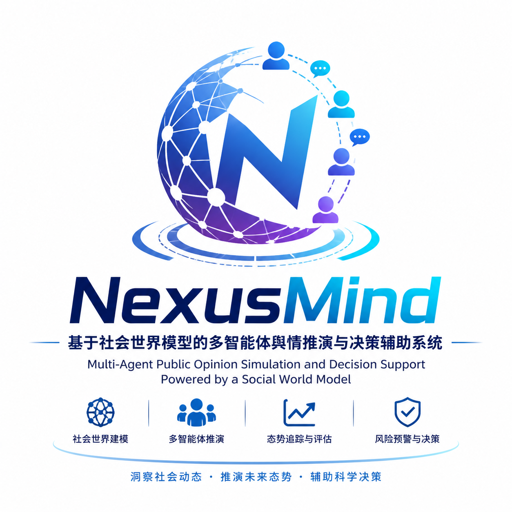

# NexusMind

> 基于社会世界模型的多智能体舆情推演与决策辅助系统  
> Multi-Agent Public Opinion Simulation and Decision Support Powered by a Social World Model

<div align="center">



[](https://github.com/666ghj/NexusMind/stargazers)
[](https://github.com/666ghj/NexusMind/network)
[](./LICENSE)
[](https://www.python.org/)
[](https://vuejs.org/)
[](https://neo4j.com/)

[中文文档](./README.md) · [English](./README-EN.md)

</div>

---

## 1. Project Introduction

**NexusMind** is a multi-agent public opinion simulation and decision support system built around a **Social World Model**. Starting from seed materials of real public events, the system automatically performs fact understanding, knowledge graph construction, multi-role population modeling, public opinion simulation, world-state tracking, causal-chain analysis, and decision brief generation.

The Social World Model represents the dynamic social environment around a public event. It does not only care about "who said what"; it continuously tracks state variables such as public attention, public trust, emotional pressure, stance polarization, overall risk, and system stability. Multiple types of Agents post, comment, repost, search, and interact across an information square and topic communities. These actions change the world state, while the world state feeds back into subsequent Agent behavior, forming a closed-loop simulation of **individual behavior → collective emergence → social situation → decision response**.

Unlike traditional public opinion systems, NexusMind does not merely summarize, classify, or perform sentiment analysis on existing materials. It attempts to simulate how an event may evolve inside a controllable digital society, helping users identify possible diffusion trends, risk turning points, key influencing factors, and intervention windows in advance.

In one sentence:

> **NexusMind is a Social World Model-driven digital sandbox for public events that can continuously update as events evolve.**

Current target scenarios include:

- **University public opinion and reputation governance**: simulate the evolution of reports, official responses, media coverage, and public discussion to identify reputation risks, trust turning points, and recovery strategies.
- **Public safety and emergency management**: simulate crowd emotion, information diffusion, and social dynamics during natural disasters, campus safety incidents, public health events, and other emergencies to optimize response plans and timing.
- **Public opinion risk early warning**: monitor and simulate the propagation paths and evolution trends of online public opinion to detect secondary risks, polarization risks, and trust crises in advance.
- **Policy communication and organizational governance**: simulate the effects of different response styles, disclosure rhythms, and resource allocation plans to support public communication and organizational decision-making.
- **Competition demonstration**: present a complete AI practice loop around real cases: material ingestion, social world modeling, multi-agent simulation, and decision assistance.

---

## 2. Core Value

### 2.1 From Static Analysis to Dynamic Simulation

Most public opinion analysis tools answer: "What has already happened?"  
NexusMind goes further and asks:

- How might the event spread next?
- Which nodes may become risk turning points?
- Which actors, topics, and pieces of information may amplify the impact?
- What benefits and side effects may different response strategies bring?

### 2.2 From Text Summarization to Social World Modeling

The system not only extracts entities, relations, and events from text, but also maintains macro-level social states, including attention, public trust, emotional pressure, stance polarization, overall risk, and system stability. Agent behavior changes the world state, and the world state influences subsequent Agent behavior through feedback.

### 2.3 From One-Off Reports to Rolling Decisions

Real public events do not end after a single analysis. NexusMind supports continuously appending new real-world materials, rebuilding factual baselines, creating forecast branches, and updating decision briefs, forming a rolling reasoning and decision loop.

---

## 3. System Overview

```text
Real-world seed materials
   │
   ▼
Text parsing / Web search / Incremental material updates
   │
   ▼
Baseline Snapshot
   │
   ▼
Knowledge Graph + Vector Retrieval: GraphRAG / VectorRAG
   │
   ▼
Agent society construction: identities, personas, cognitive priors, platform settings
   │
   ▼
Dual-platform simulation: information square + topic communities
   │
   ▼
Social World Model: six-dimensional states, event stream, causal chains, feedback loop
   │
   ▼
Report generation / Quantitative evaluation / Decision briefs / Branch comparison
```

---

## 4. Social World Model

The Social World Model is the core of the current NexusMind system. It represents how an event environment evolves under Agent behavior, external information, and collective feedback.

### 4.1 Six-Dimensional Macro State

| State Variable | Meaning | Role |
|---|---|---|
| `attention_level` | Public attention | Measures event heat and discussion scale |
| `panic_level` | Emotional pressure | Measures negative emotion, anxiety, and panic diffusion |
| `trust_level` | Public trust | Measures trust in organizations, authorities, or official responses |
| `polarization_level` | Stance polarization | Measures group disagreement and confrontation intensity |
| `risk_level` | Overall risk | Captures event escalation, secondary risks, and governance pressure |
| `stability_level` | System stability | Measures whether the public opinion environment is converging and stabilizing |

### 4.2 State Update Mechanism

After each simulation round, the system extracts observational signals from Agent actions, such as:

- posts, comments, reposts, likes, searches, and follows
- number of active Agents
- keyword and topic changes
- sentiment distribution
- platform-level behavioral differences
- event triggers and state mutations

It then uses rule layers, smoothing, natural decay, topic states, and event detection to generate a new world-state snapshot, which is persisted as JSONL data.

### 4.3 Feedback Loop

The world state is not only for visualization. The system compresses macro states into neutral, non-instructive environmental observations and injects them into the simulation subprocess so that Agents can perceive the social situation and adjust their subsequent behavior.

To avoid over-control, the system uses a damping mechanism: environmental observations are injected only when the state deviation from baseline exceeds a threshold, preserving Agent autonomy.

Related implementation:

- `backend/app/services/world_state.py`
- `backend/app/services/causal_graph.py`
- `backend/scripts/run_parallel_simulation.py`
- `backend/app/services/simulation_runner.py`
- `frontend/src/components/WorldState/`

---

## 5. Research-Inspired Engineering

NexusMind's Social World Model and Agent cognition mechanisms are inspired by research directions in multi-agent social simulation, world models, public opinion propagation, and believable Agents, and have been translated into runnable engineering components.

| Research Direction | Engineering Mapping |
|---|---|
| Social World Model | Decomposes the social environment into structure, dynamics, and personalized perception |
| Agent Society Simulation | Couples Agent attributes, emotion, cognition, and behavior generation |
| Public Opinion Simulation | Introduces belief, emotion, stance drift, and rational intervention ideas from public opinion modeling |
| Social Media Simulation | Reuses multi-platform social interaction mechanisms such as posting, commenting, reposting, and searching |
| Rumor / Information Spreading | Focuses on information cascades, group diffusion, and propagation paths |
| Generative Agents | Introduces structured scaffolds for memory, reflection, and believable behavior |
| World Models | Unifies environment state, future evolution, and decision support into one modeling objective |

These ideas are not limited to documentation; they are mapped to runnable code:

- `agent_brain.py`: AgentPrior, AgentCognitiveState, memory, and strategy scaffolds
- `world_state.py`: six-dimensional world state, event detection, Topic State, and state decay
- `causal_graph.py`: event causal edges and causal-chain inference
- `run_parallel_simulation.py`: world-state injection into Agent environmental perception
- `simulation_insight_service.py`: state evolution, risks and opportunities, scorecards, and decision briefs

---

## 6. Agent Cognitive Architecture

Agents in NexusMind are not merely static role prompts; they have computable cognitive structures.

### 6.1 AgentPrior

AgentPrior describes long-term Agent priors:

- identity type and professional role
- initial stance
- core goals
- topics of interest
- risk tolerance
- trust in authority and peers
- conformity, expressiveness, and susceptibility
- decision style

### 6.2 AgentCognitiveState

AgentCognitiveState describes cognitive variables that change across rounds:

- attention focus
- emotional arousal
- perceived risk
- information certainty
- changes in authority trust
- changes in peer trust
- current goal salience
- recent strategy and reflection prompts

### 6.3 Personalized Perception

The same macro-level world state can be perceived differently by different Agents. For example:

- Institutional Agents are more sensitive to stability, trust, and risk.
- Media Agents care more about attention, information changes, and propagation value.
- Students or ordinary public Agents are more likely to be influenced by peer feedback, emotional pressure, and stance polarization.

Related implementation:

- `backend/app/services/agent_brain.py`
- `backend/app/services/oasis_profile_generator.py`
- `backend/app/services/simulation_runner.py`

---

## 7. Product Workflow

### 7.1 Five-Step Main Flow

| Step | Name | Description |
|---|---|---|
| Step 1 | Event Graph Generation | Extract entities, relations, and event clues from materials to build a knowledge graph |
| Step 2 | Group Environment Modeling | Generate Agent profiles, cognitive priors, platform settings, and simulation parameters |
| Step 3 | Public Opinion Simulation | Agents interact in the information square and topic communities while the world model tracks situation changes |
| Step 4 | Report Generation | ReportAgent uses graph, Agent, world-model, and evaluation tools to generate a report |
| Step 5 | Deep Interaction | Continue asking questions to Agents or the report intelligence layer |

### 7.2 Incident Workspace

The Incident Workspace is designed for continuous tracking of real events:

- Route: `/incident/:projectId`
- Frontend: `frontend/src/views/IncidentWorkspaceView.vue`
- Backend: `backend/app/api/incident.py`

Supported capabilities:

- continuously append materials
- generate and switch factual baseline versions
- view material timelines
- rebuild baseline graphs
- create forecast branches
- compare different intervention plans
- export phase-specific reports

---

## 8. Core Modules

### 8.1 Material Ingestion and Knowledge Graph

- Supports PDF, Markdown, TXT, and other file materials
- Supports Tavily web search for public information retrieval
- Uses LLMs to generate prescribed ontologies
- Builds knowledge graphs with Graphiti + Neo4j
- Performs entity cleaning, pseudo-entity filtering, and entity type annotation
- Uses Neo4j vector indexes for semantic retrieval

Related files:

- `backend/app/services/text_processor.py`
- `backend/app/services/ontology_generator.py`
- `backend/app/services/graph_builder.py`
- `backend/app/services/entity_cleaner.py`
- `backend/app/services/vector_store.py`

### 8.2 Multi-Agent Social Simulation

- Social platform simulation based on CAMEL-AI OASIS
- Supports dual platforms: information square and topic communities
- Supports actions such as posting, commenting, reposting, liking, searching, and following
- Records Agent actions, platform state, and world state in each round
- Supports stop, resume, restart, and history restoration

Related files:

- `backend/app/services/simulation_runner.py`
- `backend/app/services/simulation_manager.py`
- `backend/scripts/run_parallel_simulation.py`
- `frontend/src/components/Step3Simulation.vue`

### 8.3 Causal Chains and World Events

- Automatically detects significant world-state changes
- Records key world events
- Infers causal edges between events
- Supports causal-chain tracking and visualization

Related files:

- `backend/app/services/causal_graph.py`
- `frontend/src/components/WorldState/CausalGraphView.vue`
- `frontend/src/components/WorldState/EventTimeline.vue`

### 8.4 ReportAgent Report Engine

ReportAgent uses ReACT-style multi-step reasoning and can call multiple tools to generate structured reports.

| Tool Category | Tools |
|---|---|
| Graph Retrieval | `insight_forge`, `panorama_search`, `quick_search` |
| Agent Interviews | `interview_agents` |
| World Model | `world_model_brief`, `state_evolution_analysis` |
| Causal Analysis | `causal_chain_analysis` |
| Quantitative Evaluation | `evaluation_summary` |
| Situation Scorecard | `reputation_scorecard` |
| Decision Support | `decision_support_brief` |
| Evidence Retrieval | `simulation_evidence_search` |
| Cognitive Analysis | `agent_cognition_analysis` |

Related files:

- `backend/app/services/report_agent.py`
- `backend/app/services/simulation_insight_service.py`
- `backend/app/api/report.py`

---

## 9. Quantitative Evaluation and Benchmark

The system provides post-simulation quantitative evaluation and real-case benchmark validation.

### 9.1 Evaluation Scope

- sentiment evolution timeline
- Agent behavior diversity
- world-state peaks, troughs, volatility, and turning points
- influential Agent analysis
- causal graph statistics
- world-model feedback-loop statistics

### 9.2 Benchmark Metrics

| Metric | Full Name | Weight | Meaning |
|---|---|---:|---|
| TCS | Trend Consistency Score | 35% | Whether the simulated trend direction matches real-world stages |
| TPH | Turning Point Hit Rate | 25% | Whether key real-world turning points are hit |
| KAC | Key Actor Coverage | 20% | Whether key actors are covered by the graph, Agents, and report |
| EOA | Event Order Accuracy | 20% | Whether simulated event order matches the real reference chain |

### 9.3 Typical Case Results

Current records for Case 01, a university public opinion case:

| Mode | TCS | TPH | KAC | EOA | Total Score |
|---|---:|---:|---:|---:|---:|
| Tier A / Full | 100.0 | 100.0 | 100.0 | 96.4 | **99.3 / A** |
| Tier B / Gated | 80.0 | 50.0 | 100.0 | 86.7 | **77.8 / B** |
| Tier C / Blind | 50.0 | 33.3 | 77.8 | 66.7 | **54.7 / C** |

The comparison shows that a more complete factual graph and context significantly improve trend consistency, turning-point hit rate, and event-order accuracy. When information is limited or blinded, the system can still capture part of the propagation trend, but deeper turning points and actor attribution become less accurate.

Related files:

- `benchmark/scoring.py`
- `benchmark/case_01_wuhan_university_library/`
- `backend/app/services/evaluation.py`
- `backend/app/api/evaluation.py`
- `frontend/src/api/evaluation.js`

---

## 10. Technical Architecture

| Layer | Technologies and Modules |
|---|---|
| Frontend | Vue 3, Vite, D3.js, visualization components |
| Backend | Flask 3.x, REST API, local file persistence, asynchronous task management |
| Graph Layer | Graphiti, Neo4j, GraphRAG, VectorRAG |
| Simulation Layer | CAMEL-AI OASIS, dual-platform social interaction simulation |
| World Model | WorldStateEngine, CausalGraphEngine, AgentBrain, SimulationInsightService |
| Report Layer | ReACT ReportAgent, multi-tool calling, Markdown/HTML/PDF export |
| Evaluation Layer | Benchmark scoring, sentiment / behavior / influence / state-evolution analysis |

Core directory structure:

```text
NexusMind/
├── frontend/                         # Vue 3 + Vite frontend
│   └── src/
│       ├── views/                    # Home / Process / IncidentWorkspace / SimGraph
│       ├── components/               # Five-step flow components and world-model components
│       └── api/                      # graph / simulation / report / evaluation / incident APIs
├── backend/
│   ├── app/
│   │   ├── api/                      # Flask REST APIs
│   │   ├── services/                 # Core graph, simulation, world-model, report, and evaluation logic
│   │   ├── models/                   # Project / Material / Baseline / ForecastRun
│   │   └── utils/                    # LLM, Graphiti, parsing, logging, and utility modules
│   ├── scripts/
│   │   └── run_parallel_simulation.py # OASIS subprocess and world-state injection
│   └── uploads/                      # Local runtime data, simulation logs, and report artifacts
├── benchmark/                        # Real-case evaluation and scoring scripts
├── word_modle/papers/                # Social world model paper analysis and planning documents
├── static/image/                     # README images and presentation assets
└── docker-compose.yml
```

---

## 11. Quick Start

### 11.1 Requirements

| Component | Recommended Version |
|---|---|
| Python | 3.11+ |
| Node.js | 18+ |
| Neo4j | 5.x |
| npm | 9+ |

### 11.2 Environment Variables

Create a `.env` file in the project root:

```env
LLM_API_KEY=your_api_key
LLM_BASE_URL=https://dashscope.aliyuncs.com/compatible-mode/v1
LLM_MODEL_NAME=qwen-plus

NEO4J_URI=bolt://localhost:7687
NEO4J_USERNAME=neo4j
NEO4J_PASSWORD=your_neo4j_password
NEO4J_DATABASE=neo4j

# Optional: web search
TAVILY_API_KEY=your_tavily_api_key
```

If your local Neo4j uses custom ports, update `NEO4J_URI` accordingly.

### 11.3 Install Dependencies

```bash
# Root dependencies + frontend dependencies
npm run setup

# Backend dependencies using uv
npm run setup:backend
```

Manual installation is also possible:

```bash
# Frontend
npm --prefix frontend install

# Backend
python -m pip install -r backend/requirements.txt
```

### 11.4 Start Services

```bash
# Start both frontend and backend from the project root
npm run dev
```

Or start them separately:

```bash
npm run backend
npm run frontend
```

Default URLs:

- Frontend: `http://localhost:3000`
- Backend: `http://localhost:5001`
- Neo4j Browser: `http://localhost:7474`
- Neo4j Bolt: `bolt://localhost:7687`

### 11.5 Start with Docker Compose

To start Neo4j and NexusMind together with containers:

```bash
docker compose up -d
```

`docker-compose.yml` reads the `.env` file from the project root. `NEO4J_USERNAME` and `NEO4J_PASSWORD` are used to initialize the Neo4j container credentials.

---

## 12. Competition Demo Suggestions

For a software design competition demo, it is better not to introduce buttons one by one. Instead, present the system around the continuous evolution of a real event.

Recommended storyline:

1. **Real-world seed ingestion**: upload first-stage materials and show that the system can start from limited early information.
2. **Fact and graph construction**: show how entities, relations, and event clues are structured.
3. **Public opinion simulation**: show Agents interacting in the information square and topic communities while the Social World Model tracks six-dimensional states.
4. **World-model explanation**: emphasize that the system is not summarizing existing materials, but simulating diffusion trends, risk turning points, and key influencing factors.
5. **Incident Workspace rolling update**: append subsequent materials to generate new baselines and forecast branches.
6. **Decision support output**: show risks, opportunities, recommended actions, and evidence chains.

Core message:

> We do not analyze an event only once. As the event evolves, NexusMind continuously updates factual baselines, graph understanding, social states, and decision judgments.

---

## 13. Open Source and Acknowledgments

NexusMind is made possible by the open-source ecosystem and related academic research:

- Thanks to **CAMEL-AI OASIS** for providing the multi-agent social simulation foundation.
- Thanks to **MiroFish** for its open-source inspiration and reference value. While following the relevant open-source license and acknowledgment requirements, NexusMind reorganizes the system goals and engineering implementation for university and public-opinion events by integrating simulation orchestration, population-environment modeling, scenario configuration generation, runtime state management, decision briefs, and interactive analysis into a closed-loop simulation workflow. The project focuses on a paper-based Social World Model, incremental material ingestion, rolling forecasting, and decision support.
- Thanks to **Graphiti / Neo4j** for supporting the knowledge graph and retrieval layer.
- Thanks to Vue, Flask, D3, OpenAI SDK, and other open-source projects.
- The Social World Model and Agent cognition design are inspired by research directions such as Social World Models, Agent Society Simulation, Public Opinion Simulation, Generative Agents, and World Models.

This project is released under the `AGPL-3.0` license. If you develop or deploy derivative work based on this project, please comply with the corresponding open-source license. Third-party acknowledgments, MiroFish reference notes, and copyright-preservation notices are provided in [`NOTICE`](./NOTICE).