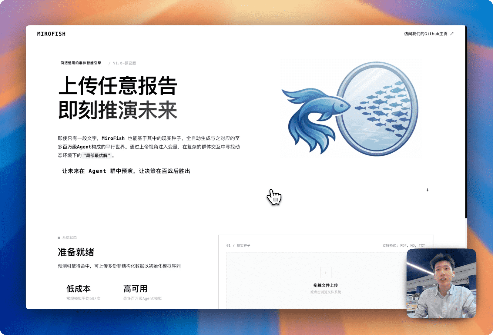

<div align="center">


<a href="https://trendshift.io/repositories/16144" target="_blank"></a>

简洁通用的群体智能引擎，预测万物
</br>
<em>A Simple and Universal Swarm Intelligence Engine, Predicting Anything</em>

<a href="https://www.shanda.com/" target="_blank"></a>

[](https://github.com/666ghj/NexusMind/stargazers)
[](https://github.com/666ghj/NexusMind/watchers)
[](https://github.com/666ghj/NexusMind/network)
[](https://hub.docker.com/)
[](https://deepwiki.com/666ghj/NexusMind)

[](http://discord.gg/ePf5aPaHnA)
[](https://x.com/NexusMind_ai)
[](https://www.instagram.com/NexusMind_ai/)

[English](./README-EN.md) | [中文文档](./README.md)

</div>

## ⚡ 项目概述

**NexusMind** 是一款基于多智能体技术的新一代 AI 预测引擎。通过提取现实世界的种子信息（如突发新闻、政策草案、金融信号），自动构建出高保真的平行数字世界。在此空间内，成千上万个具备独立人格、认知状态与行为逻辑的智能体进行自由交互与社会演化。系统内置**世界模型引擎**实时追踪六维宏观状态与因果链，驱动 Agent 认知反馈闭环。你可透过「上帝视角」动态注入变量，精准推演未来走向——**让未来在数字沙盘中预演，助决策在百战模拟后胜出**。

> 你只需：上传种子材料（数据分析报告或者有趣的小说故事），并用自然语言描述预测需求</br>
> NexusMind 将返回：一份详尽的预测报告，以及一个可深度交互的高保真数字世界

### 我们的愿景

NexusMind 致力于打造映射现实的群体智能镜像，通过捕捉个体互动引发的群体涌现，突破传统预测的局限：

- **于宏观**：我们是决策者的预演实验室，让政策与公关在零风险中试错
- **于微观**：我们是个人用户的创意沙盘，无论是推演小说结局还是探索脑洞，皆可有趣、好玩、触手可及

从严肃预测到趣味仿真，我们让每一个如果都能看见结果，让预测万物成为可能。

## 🌐 在线体验

欢迎访问在线 Demo 演示环境，体验我们为你准备的一次关于热点舆情事件的推演预测：[NexusMind-live-demo](https://666ghj.github.io/mirofish-demo/)

## 📸 系统截图

<div align="center">
<table>
<tr>
<td></td>
<td></td>
</tr>
<tr>
<td></td>
<td></td>
</tr>
<tr>
<td></td>
<td></td>
</tr>
</table>
</div>

## 🎬 演示视频

### 1. 武汉大学舆情推演预测 + NexusMind项目讲解

<div align="center">
<a href="https://www.bilibili.com/video/BV1VYBsBHEMY/" target="_blank"></a>

点击图片查看使用微舆BettaFish生成的《武大舆情报告》进行预测的完整演示视频
</div>

### 2. 《红楼梦》失传结局推演预测

<div align="center">
<a href="https://www.bilibili.com/video/BV1cPk3BBExq" target="_blank"></a>

点击图片查看基于《红楼梦》前80回数十万字，NexusMind深度预测失传结局
</div>

> **金融方向推演预测**、**时政要闻推演预测**等示例陆续更新中...

## 🏗️ 技术架构

| 层次 | 技术栈 |
|------|--------|
| **前端** | Vue 3 + Vite + D3.js + ECharts（知识图谱 & 因果图谱可视化） |
| **后端** | Flask 3.x + Graphiti + Neo4j（知识图谱与向量存储） |
| **模拟引擎** | [OASIS](https://github.com/camel-ai/oasis) 多智能体仿真框架（camel-oasis 0.2.5） |
| **世界模型** | 六维状态引擎 + 因果图谱引擎 + Agent 认知架构（AgentBrain） |
| **报告引擎** | ReACT 多轮推理 + 11 种工具（图谱检索 / Agent 采访 / 世界模型洞察） |
| **LLM** | 兼容 OpenAI SDK 格式的任意大模型 API |

## 🧠 核心能力

### 世界模型引擎

NexusMind 内置论文级世界模型（参考 POSIM、SocioVerse、AgentSociety 等），在模拟运行过程中实时构建宏观态势感知：

- **六维状态追踪**：关注度、恐慌情绪、公众信任、立场极化、综合风险、系统稳定性，每轮自动更新
- **世界事件检测**：当状态变量发生显著变化时自动识别关键事件（如信息级联、信任崩塌）
- **因果图谱**：从事件序列和状态变化中推断因果边，支持因果链追踪和影响路径查询
- **反馈闭环**：世界状态通过 IPC 通道实时回注 OASIS 子进程，影响 Agent 后续决策（含阻尼机制，偏差 > 0.15 时才注入）

### Agent 认知架构（AgentBrain）

每个模拟 Agent 拥有独立的认知状态，而非简单的 Prompt 角色扮演：

- **AgentPrior**：从知识图谱人设中编译出先验特征（易感性、求真性、从众性、风险容忍度等）
- **AgentCognitiveState**：认知状态随模拟进程动态演化（情感、立场、焦虑、信任等）
- **个性化感知渲染**：同一世界状态对不同 Agent 渲染出差异化环境信号（机构类看稳定度，媒体类看信息流，高从众者看群体趋势）
- **认知衰减与遗忘**：非活跃认知维度自然衰减回基线

### 报告生成引擎

ReportAgent 通过 ReACT（Reasoning + Acting）多轮推理，自主调用 **11 种工具** 生成深度分析报告：

| 类别 | 工具 | 说明 |
|------|------|------|
| 图谱检索 | InsightForge / PanoramaSearch / QuickSearch | 混合检索（GraphRAG + VectorRAG 双路召回） |
| Agent 采访 | AgentInterview | 模拟中实时采访任意 Agent |
| 世界模型 | WorldModelBrief | 六维状态全景摘要 |
| 状态演化 | StateEvolutionAnalysis | 峰值/谷值/转折点分析 |
| 因果分析 | CausalChainAnalysis | 因果链追踪与归因 |
| 评估摘要 | EvaluationSummary | 量化评估指标汇总 |
| 态势评分 | ReputationScorecard | 综合态势四维评分卡 |
| 决策支持 | DecisionSupportBrief | 风险/机会/建议简报 |
| 证据检索 | SimulationEvidenceSearch | 模拟行为日志检索 |

### 量化评估框架

- **情感演化时序**：逐轮追踪正面/负面/中立情感分布
- **Agent 行为多样性**：衡量 Agent 行为的丰富程度
- **世界状态演化摘要**：六维状态的峰值、谷值与转折点
- **影响力分析**：识别最具影响力的 Agent 与事件

### Benchmark 验证

通过真实案例对照验证系统有效性，四维评分体系：

| 指标 | 全称 | 权重 | 含义 |
|------|------|------|------|
| **TCS** | Trend Consistency Score | 35% | 模拟情绪走势与现实是否同涨同跌 |
| **TPH** | Turning Point Hit Rate | 25% | 是否抓住现实中的关键拐点 |
| **KAC** | Key Actor Coverage | 20% | 关键主体是否被系统覆盖 |
| **EOA** | Event Order Accuracy | 20% | 事件顺序是否与现实一致 |

**已完成案例**：武汉大学舆情事件 — 综合评分 **88.8/100（A 级）**

## 🔄 工作流程

```
种子材料 ──→ 知识图谱 ──→ Agent 世界 ──→ 推演模拟 ──→ 报告 / 评估
 (文件/网络)    (Graphiti)   (OASIS)      (世界模型)    (ReACT Agent)
```

1. **图谱构建**：上传种子材料（PDF / Markdown / TXT）或输入网络搜索关键词（Tavily API 自动抓取）→ LLM 自动生成本体（Prescribed Ontology） → Graphiti + Neo4j 构建知识图谱 → 伪实体清洗 → 实体类型标注
2. **环境搭建**：从图谱中读取并过滤实体 → LLM 智能生成 Agent 人设（含认知先验编译）→ 自动配置模拟参数（平台类型、轮次、时间线、事件序列等）
3. **推演模拟**：Twitter / Reddit 双平台并行模拟 → Agent 自主交互与涌现 → 世界模型六维状态实时追踪 → 因果图谱自动构建 → 支持上帝模式动态事件注入 → 模拟图谱实时写回 Neo4j
4. **报告生成**：ReportAgent 通过 ReACT 多轮推理，调用 11 种工具（图谱检索 + Agent 采访 + 世界模型洞察），并行生成结构化分析报告
5. **深度互动**：与模拟世界中的任意 Agent 对话 → 与 ReportAgent 追问交流 → 查看量化评估仪表盘

## 📁 项目结构

```
NexusMind/
├── frontend/                     # 前端（Vue 3 + Vite）
│   └── src/
│       ├── components/           # 五步流程组件 + 世界模型面板
│       │   ├── Step1GraphBuild   # 图谱构建
│       │   ├── Step2EnvSetup     # 环境搭建
│       │   ├── Step3Simulation   # 推演模拟
│       │   ├── Step4Report       # 报告生成
│       │   ├── Step5Interaction  # 深度互动
│       │   ├── WorldState/       # 世界模型可视化子组件
│       │   │   ├── WorldStateHero      # 六维状态雷达图
│       │   │   ├── EventTimeline       # 事件时间线
│       │   │   ├── CausalGraphView     # 因果图谱 D3 力导向图
│       │   │   ├── AgentActionCard     # Agent 行为卡片
│       │   │   └── SimGraphView        # 模拟图谱可视化
│       │   └── WorldStatePanel   # Step3 世界模型侧边栏
│       ├── views/                # 页面视图
│       │   ├── Home              # 首页
│       │   ├── Process           # 五步流程主页
│       │   ├── EvaluationView    # 量化评估仪表盘
│       │   └── SimGraphPage      # 模拟图谱全屏页
│       └── api/                  # API 调用层
├── backend/                      # 后端（Flask 3.x）
│   ├── app/
│   │   ├── api/                  # REST API
│   │   │   ├── graph.py          # 图谱 API
│   │   │   ├── simulation.py     # 模拟 API（含世界模型 & IPC）
│   │   │   ├── report.py         # 报告 API
│   │   │   └── evaluation.py     # 评估 API
│   │   ├── services/             # 核心业务逻辑
│   │   │   ├── graph_builder.py              # 知识图谱构建
│   │   │   ├── ontology_generator.py         # LLM 本体生成
│   │   │   ├── entity_reader.py              # 实体读取与过滤
│   │   │   ├── entity_cleaner.py             # 伪实体清洗
│   │   │   ├── entity_type_annotator.py      # 实体类型标注
│   │   │   ├── vector_store.py               # 向量 RAG 存储（Neo4j 向量索引）
│   │   │   ├── oasis_profile_generator.py    # Agent 人设生成
│   │   │   ├── simulation_config_generator.py # 模拟参数配置
│   │   │   ├── simulation_manager.py         # 模拟管理器
│   │   │   ├── simulation_runner.py          # 模拟运行器
│   │   │   ├── simulation_ipc.py             # IPC 进程间通信
│   │   │   ├── world_state.py                # 六维世界状态引擎
│   │   │   ├── causal_graph.py               # 因果图谱引擎
│   │   │   ├── agent_brain.py                # Agent 认知架构
│   │   │   ├── graph_memory_updater.py       # 模拟图谱实时写回
│   │   │   ├── graph_tools.py                # 图谱检索工具
│   │   │   ├── report_agent.py               # ReACT 报告生成
│   │   │   ├── simulation_insight_service.py # 模拟洞察聚合
│   │   │   ├── evaluation.py                 # 量化评估框架
│   │   │   └── web_scraper.py                # 网络搜索（Tavily）
│   │   ├── utils/                # 工具库
│   │   │   ├── llm_client.py     # LLM 统一客户端
│   │   │   ├── graphiti_client.py # Graphiti / Neo4j 客户端
│   │   │   ├── file_parser.py    # 文件解析（PDF/MD/TXT）
│   │   │   └── retry.py          # 重试机制
│   │   └── models/               # 数据模型
│   ├── scripts/                  # 模拟子进程脚本
│   │   └── run_parallel_simulation.py  # OASIS 并行模拟（含世界模型注入）
│   └── tests/                    # 测试套件（48+ 单元测试）
├── benchmark/                    # Benchmark 验证框架
│   ├── scoring.py                # 四维评分脚本
│   ├── case_01_wuhan_university_library/   # 武大舆情（88.8/100 A级）
│   ├── case_02_tesla_shanghai_autoshow/    # 特斯拉上海车展
│   └── case_03_lijiaqi_huaxizi/           # 李佳琦花西子
└── docker-compose.yml            # Docker 一键部署
```

## 🚀 快速开始

### 一、源码部署（推荐）

#### 前置要求

| 工具 | 版本要求 | 说明 | 安装检查 |
|------|---------|------|---------|
| **Node.js** | 18+ | 前端运行环境，包含 npm | `node -v` |
| **Python** | ≥3.11, ≤3.12 | 后端运行环境 | `python --version` |
| **uv** | 最新版 | Python 包管理器 | `uv --version` |
| **Neo4j** | 5.x | 知识图谱存储 | 访问 `http://localhost:7474` |

> **Neo4j 安装**：推荐安装 [Neo4j Desktop](https://neo4j.com/download/)（Windows/Mac 图形化管理），或使用 Docker：`docker run -d -p 7474:7474 -p 7687:7687 -e NEO4J_AUTH=neo4j/your_password neo4j:5-community`

#### 1. 配置环境变量

```bash
# 复制示例配置文件
cp .env.example .env

# 编辑 .env 文件，填入必要的 API 密钥
```

**必需的环境变量：**

```env
# LLM API配置（支持 OpenAI SDK 格式的任意 LLM API）
# 推荐使用阿里百炼平台qwen-plus模型：https://bailian.console.aliyun.com/
# 注意消耗较大，可先进行小于40轮的模拟尝试
LLM_API_KEY=your_api_key
LLM_BASE_URL=https://dashscope.aliyuncs.com/compatible-mode/v1
LLM_MODEL_NAME=qwen-plus

# Neo4j 图数据库配置
# 安装 Neo4j Desktop: https://neo4j.com/download/
NEO4J_URI=bolt://localhost:7687
NEO4J_USERNAME=neo4j
NEO4J_PASSWORD=your_neo4j_password
```

**可选配置：**

```env
# 加速 LLM（用于 Profile 生成等高频调用，可选独立的低成本模型）
# 如不使用，请勿添加以下配置项
LLM_BOOST_API_KEY=your_api_key
LLM_BOOST_BASE_URL=your_base_url
LLM_BOOST_MODEL_NAME=your_model_name

# 网络搜索（自动抓取公开舆情信息作为种子材料）
# 免费注册：https://tavily.com
TAVILY_API_KEY=your_tavily_api_key
```

#### 2. 安装依赖

```bash
# 一键安装所有依赖（根目录 + 前端 + 后端）
npm run setup:all
```

或者分步安装：

```bash
# 安装 Node 依赖（根目录 + 前端）
npm run setup

# 安装 Python 依赖（后端，自动创建虚拟环境）
npm run setup:backend
```

#### 3. 启动服务

```bash
# 同时启动前后端（在项目根目录执行）
npm run dev
```

**服务地址：**
- 前端：`http://localhost:3000`
- 后端 API：`http://localhost:5001`

**单独启动：**

```bash
npm run backend   # 仅启动后端
npm run frontend  # 仅启动前端
```

### 二、Docker 部署

```bash
# 1. 配置环境变量（同源码部署）
cp .env.example .env

# 2. 拉取镜像并启动
docker compose up -d
```

默认会读取根目录下的 `.env`，并映射端口 `3000（前端）/5001（后端）`

> 在 `docker-compose.yml` 中已通过注释提供加速镜像地址，可按需替换

## 📬 更多交流

<div align="center">

</div>

&nbsp;

NexusMind团队长期招募全职/实习，如果你对多Agent应用感兴趣，欢迎投递简历至：**nexusmind@shanda.com**

## 📄 致谢

**NexusMind 得到了盛大集团的战略支持和孵化！**

NexusMind 的仿真引擎由 **[OASIS (Open Agent Social Interaction Simulations)](https://github.com/camel-ai/oasis)** 驱动，我们衷心感谢 CAMEL-AI 团队的开源贡献！

世界模型设计参考了以下学术成果：POSIM、SocioVerse、AgentSociety、MOSAIC、OASIS、Generative Agents 等。

## 📈 项目统计

<a href="https://www.star-history.com/#666ghj/NexusMind&type=date&legend=top-left">
 <picture>
   <source media="(prefers-color-scheme: dark)" srcset="https://api.star-history.com/svg?repos=666ghj/NexusMind&type=date&theme=dark&legend=top-left" />
   <source media="(prefers-color-scheme: light)" srcset="https://api.star-history.com/svg?repos=666ghj/NexusMind&type=date&legend=top-left" />
   
 </picture>
</a>
